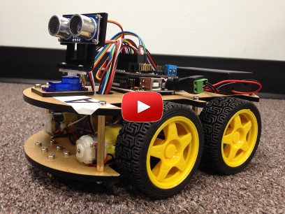

# toy-autonomous-car

In this project, we

1. build a Toy Car from a robot car kit purchased from Amazon
2. program the Arduino board on the car to make the car drive "on demand" by a Deep Neural Network
3. train a Deep Neural Network to identify US traffic signs
4. build a image processing pipeline that 
    - captures frames from a camera stream
    - pre-process it to isolate region of interest
    - apply DNN prediction on ROI to identify US traffic sign
	- send appropriate command to the car to turn-left, turn-right, or stop
 
 ## Result
 
 